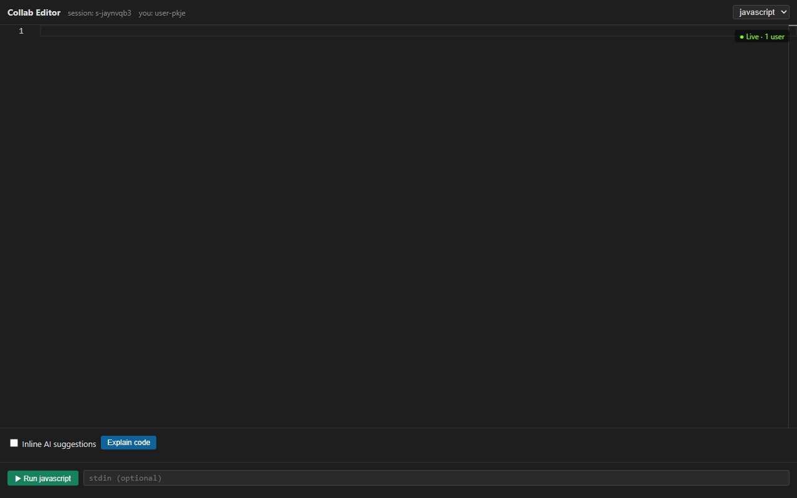

# Real-Time Collaborative Code Editor



A production-grade, horizontally scalable collaborative code editor with Operational Transformation, AI assistance, and sandboxed multi-language execution. Think VS Code Live Share, but built from scratch with the data-structure choices justified.

## What's in here

- **OT engine** with verified convergence (4 correctness tests pass)
- **WebSocket server** with sticky-session-friendly cross-node coordination via Redis Pub/Sub
- **Per-session FIFO queues** with O(1) enqueue/dequeue
- **HashMap-based session manager** with O(1) lookups for sessionId → state and userId → socket
- **Set-based presence** tracked both per-pod and cluster-wide
- **Reconnecting frontend** with client-side OT (pending buffer + transform-against-pending)
- **Monaco editor** with per-user remote cursors and selection highlighting
- **AI service** with prefix-window prompting, LRU caching, debounced requests
- **Docker-sandboxed execution** for Python / JS / C++ with `--network none`, `--read-only`, `--cap-drop=ALL`, memory caps, pid limits, wall-clock timeout
- **Full Docker Compose stack** (Redis + 2 backend nodes + nginx LB + exec engine + frontend)
- **Kubernetes manifests** with HPA, PDB, pod surge capacity

## Folder structure

```
collab-editor/
├── README.md                     ← you are here
├── docs/
│   ├── ot-vs-crdt.md             ← when to choose which
│   ├── bottleneck-analysis.md    ← what breaks first as you scale
│   ├── interview-narrative.md    ← system design interview script
│   └── scaling-1m.md             ← architecture for 1M+ concurrent users
├── docker-compose.yml            ← full local stack
├── nginx-lb.conf                 ← sticky-session WS load balancer
├── k8s/
│   ├── backend-deployment.yaml   ← Deployment + Service + HPA + PDB
│   ├── redis-statefulset.yaml
│   └── ingress.yaml              ← cookie-based session affinity
│
├── backend/
│   ├── src/
│   │   ├── server.js             ← HTTP + WS bootstrap
│   │   ├── config.js
│   │   ├── ot/
│   │   │   ├── operation.js      ← op factories
│   │   │   ├── transform.js      ← TP1-correct transform()
│   │   │   └── document.js       ← canonical doc + history compaction
│   │   ├── services/
│   │   │   ├── sessionManager.js ← HashMap of sessions
│   │   │   ├── operationQueue.js ← FIFO with safe re-entrancy
│   │   │   ├── redisService.js   ← pub/sub + persistence + presence
│   │   │   ├── aiService.js      ← OpenAI/Gemini adapter w/ LRU cache
│   │   │   └── executionService.js
│   │   ├── workers/opProcessor.js
│   │   ├── ws/socketHandler.js   ← join/op/cursor handlers, resync
│   │   ├── routes/               ← /auth, /ai, /run
│   │   ├── middleware/auth.js    ← JWT
│   │   └── utils/logger.js
│   ├── ot_test.js                ← OT convergence tests (run: npm test)
│   ├── package.json
│   └── Dockerfile
│
├── frontend/
│   ├── index.html
│   ├── src/
│   │   ├── App.jsx
│   │   ├── main.jsx
│   │   ├── components/
│   │   │   ├── Editor.jsx        ← Monaco + collab session
│   │   │   ├── RemoteCursors.jsx ← decoration-based remote carets
│   │   │   ├── PresencePanel.jsx
│   │   │   ├── AIPanel.jsx
│   │   │   └── RunPanel.jsx
│   │   ├── hooks/
│   │   │   ├── useCollabSession.js  ← Monaco↔OT↔WS glue
│   │   │   └── useDebouncedAI.js
│   │   ├── services/
│   │   │   ├── ws.js             ← reconnecting WS w/ outbox
│   │   │   ├── otClient.js       ← client-side OT bookkeeping
│   │   │   └── otTransform.js    ← MUST mirror backend/src/ot/transform.js
│   │   └── utils/colors.js       ← stable per-user colors
│   ├── package.json
│   ├── vite.config.js
│   └── Dockerfile
│
└── execution-engine/
    ├── src/runner.js             ← spawns hardened docker containers
    ├── docker/
    │   ├── python.Dockerfile
    │   ├── node.Dockerfile
    │   └── cpp.Dockerfile
    ├── package.json
    └── Dockerfile
```

## Quick start (local)

```bash
# Bring up the full stack: Redis, 2 backends, exec engine, LB, frontend
docker compose up --build

# Open the editor:
open http://localhost:8080

# To test multi-user collab:
# Open the same URL in a second browser tab/window — they auto-join
# the same session via the URL ?session=... parameter
```

For AI features, set `OPENAI_API_KEY` in your environment before `docker compose up`.

## Quick start (no Docker, dev mode)

```bash
# Terminal 1: Redis
docker run --rm -p 6379:6379 redis:7-alpine

# Terminal 2: Execution engine
cd execution-engine && npm install && npm start

# Terminal 3: Backend
cd backend && npm install && npm test    # runs OT convergence tests
cd backend && npm run dev

# Terminal 4: Frontend
cd frontend && npm install && npm run dev
# open http://localhost:5173
```

## Data structures used and why

| Structure | Where | Why |
|---|---|---|
| **HashMap (`Map`)** | `sessionManager.sessions`, `userSocket` | O(1) lookup — the hottest path in the system runs through these |
| **FIFO Queue (`array push/shift`)** | `OperationQueue` per session | OT correctness depends on processing order; per-session means parallelism between sessions |
| **Set** | `session.activeUsers`, Redis `presence:{sid}` | O(1) membership for join/leave |
| **String buffer** | `ServerDocument.text` | Simple, fast for ≤ 100KB docs. Swap for rope/piece-table beyond that. |
| **Op log array** | `ServerDocument.history` | Indexed by revision; sliced from `baseRev` for transform |
| **Redis Pub/Sub** | `room:{sessionId}` channels | O(1) publish, O(subscribers) deliver — no N² mesh between Node instances |
| **LRU cache** | `AIService.cache` | Bounded-memory deduplication of identical prompts |

## Operational Transformation explained

Every edit is an `Operation` with a `baseRev` — the server revision the client based it on. When the server gets an op authored against an older revision, it transforms the op against every op in history since `baseRev`, then applies it.

The transform function satisfies TP1: `apply(apply(D, a), b') === apply(apply(D, b), a')` where `(a', b') = transform(a, b)`.

Tie-breaking when two inserts hit the exact same position: lexicographic comparison of `clientId`. Both peers MUST agree on this rule or convergence breaks.

See [`docs/ot-vs-crdt.md`](docs/ot-vs-crdt.md) for the full comparison.

## Reading order for the docs

1. **This README** — overview + structure
2. [`docs/ot-vs-crdt.md`](docs/ot-vs-crdt.md) — why OT, when to switch
3. [`docs/bottleneck-analysis.md`](docs/bottleneck-analysis.md) — what breaks first as you scale
4. [`docs/scaling-1m.md`](docs/scaling-1m.md) — architecture for 1M concurrent users
5. [`docs/interview-narrative.md`](docs/interview-narrative.md) — how to walk through this in 45 minutes

## Production deployment to Kubernetes

```bash
# Build and push images
docker build -t registry.example.com/collab-backend:v1 backend/
docker build -t registry.example.com/collab-exec:v1 execution-engine/
docker build -t registry.example.com/collab-frontend:v1 \
  --build-arg VITE_API_URL=https://collab.example.com \
  --build-arg VITE_WS_URL=wss://collab.example.com/ws \
  frontend/
docker push registry.example.com/collab-backend:v1   # etc.

# Apply manifests
kubectl create secret generic collab-secrets \
  --from-literal=jwt=$(openssl rand -hex 32) \
  --from-literal=openai=$OPENAI_API_KEY

kubectl apply -f k8s/redis-statefulset.yaml
kubectl apply -f k8s/backend-deployment.yaml
kubectl apply -f k8s/ingress.yaml
```

The HPA in `backend-deployment.yaml` scales pods on CPU + WebSocket connection count (the latter requires prometheus-adapter exposing `websocket_connections` as a custom metric).

## Known limitations & what I'd do next

- **Document buffer is a plain string.** Fine for typical files; for > 1MB swap in a rope/piece-table.
- **Op log is in-memory per session, not durable.** A pod restart loses ops since the last 50-op snapshot. Fix: use Redis Streams as the source of truth for the op log.
- **Cross-node fanout via Redis Pub/Sub is best-effort.** A subscriber that misses a message during a Redis blip won't notice. Fix: gap-detection by revision number + replay from the persisted op log.
- **Docker socket mounted into the exec engine** is effectively root on the host. Fix in production: Sysbox, gVisor, or Firecracker.
- **No end-to-end metrics.** Add Prometheus on event-loop lag, op-queue depth, p99 transform latency, Redis fanout latency.

These are flagged in code comments where relevant.

## License

MIT — use freely.
